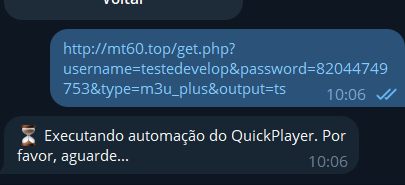

[x] Criar mensagens de espera para instruir o usuario e ele saber que ta acontecendo alguma coisa. 

[x] Quando voltar, não editar mensagens, criar novas

[x] Melhorar fluxo do Max Player, está sem botão de voltar

[ ]tirar o botão de iniciar automação, está bem ruim.

[ ] Depois que digito /sair o bnot mostra a mensgem de saída normal, mas se eu digito qualquer coisa ele recebe como login e pede uma senha.

[ ] Remover a funcionalidade de gravação de video, manter os delays entre ações